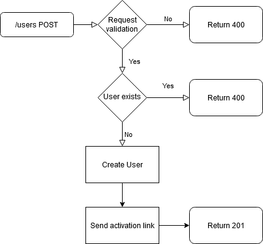
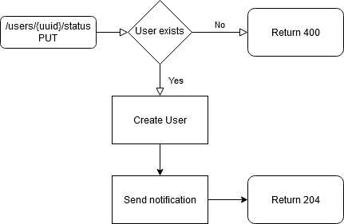
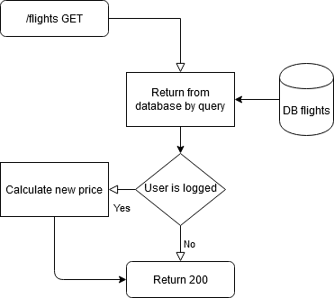
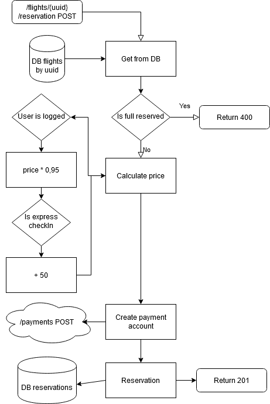
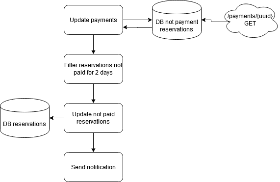
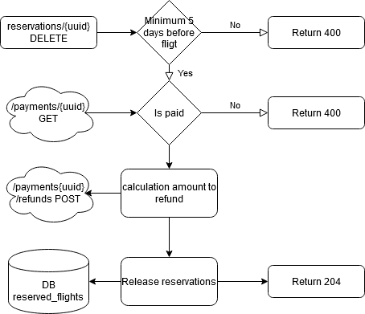

DATABASE
===
Users
---
|id|UUID|
|---|---|
|email|varchar|
|password|varchar|
|active|byte|
|creation_date|timestamp|
|modification_date|timestamp|
|technical_user|byte|

Reservations
---
|id|UUID|
|---|---|
|date|timestamp|
|status|varchar|
|amount|number|
|number_of_people|number|
|user_id|uuid|
|flight_id|uuid|

Flights
---
|id|UUID|
|---|---|
|name|varchar|
|start|varchar|
|destination|varchar|
|number_of_seats_available|number|

FLOW
===
registration flow
---
Request Body
```json
{
  "email": "string",
  "password": "string"
}
```


activation user flow
--


search flights
--
Request Query
```http request
?start={number}&destination={number}&dateFrom={text}&dateTo={text}&numberOfPeople={number}
```


create reservation
--
Request Body
```json
{
  "numberOfPeople": "number",
  "expressCheckIn": "boolean"
}
```


scheduler for cancel reservation
--


cancel_reservation.png
--

